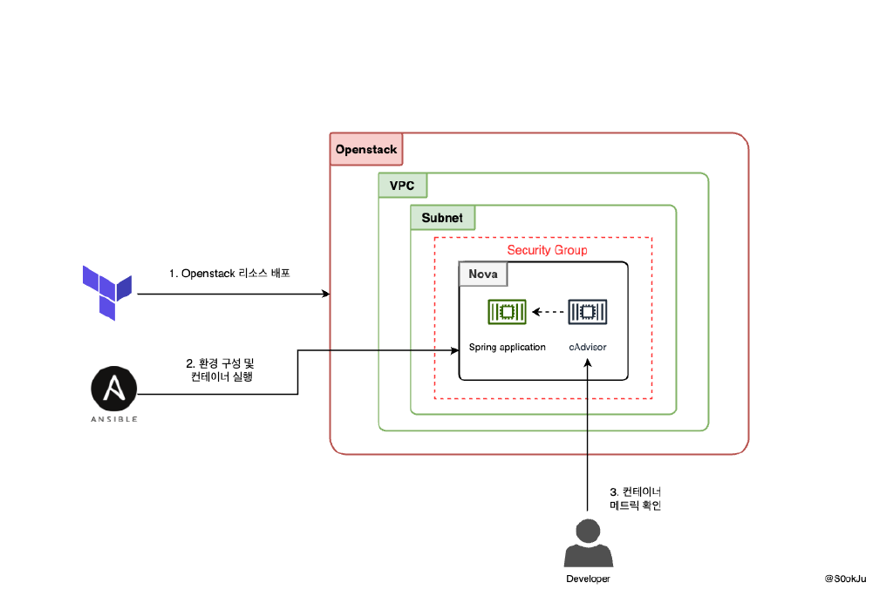
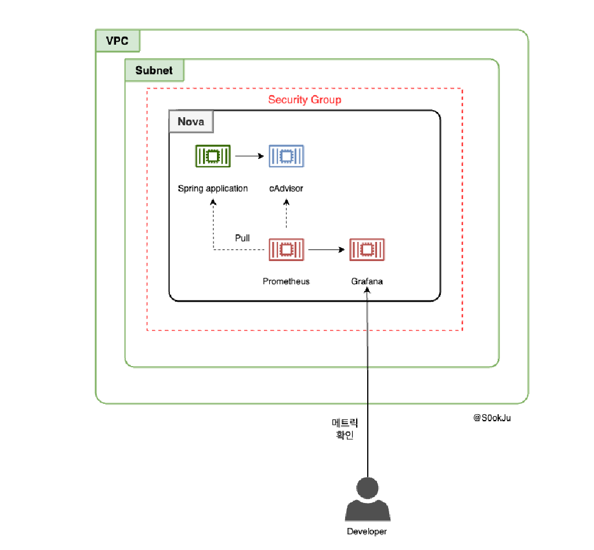

# What is OpsAthlan?
- Ops(운영) + Athlan(경기)의 합성어로 시나리오 기반으로 개발, 배포, 운영을 수행합니다.
- 학습을 위한 사이드 프로젝트이며 기술 블로그를 많이 참고합니다. 참고 시 출처를 남길 예정입니다. 

# 서버 환경
- Ubuntu 22.04
- Openstack 2024.01

# 기본적으로 사용하는 기술스택
- Teraform
- Ansibl기

# 시나리오 

### 1. 스프링부트 웹 애플리케이션을 배포해보자!
#### 기술 스택
- Docker
- SpringBoot
- cAdvisor

#### 사용 리소스
- Nova

#### 구성도

### 2. 스프링부트 웹 애플리케이션의 지표를 확인해보자! 
#### 기술 스택
- Docker
- Spring Boot
- Prometheus & Grafana

#### 사용 리소스
- Nova

#### 구성도

  
### 3. 데이터베이스를 배포해보자!
- 진행중 🏃🏻...

